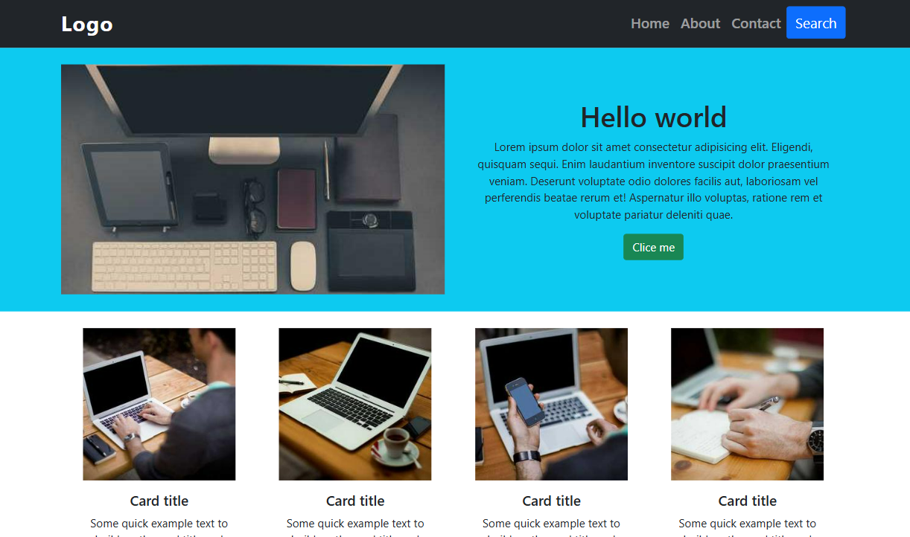
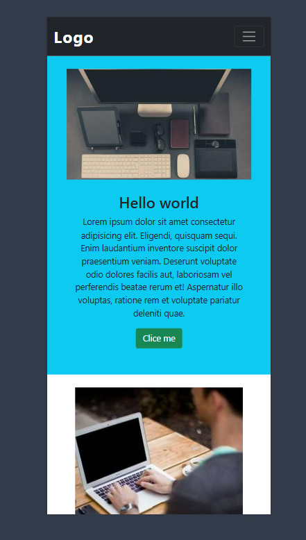

# 🌐 WebSite - Responsive Web Design (Bootstrap & HTML)

## 🖼 Preview  
### 🖥️ Desktop View  
  
### 📱 Mobile View  
  

This project is a **fully responsive** web design built using **Bootstrap and HTML** to ensure compatibility across all devices.

## 📌 Features  
- 🎨 **Modern & Clean Design** – Beautiful UI with smooth animations  
- 📱 **Fully Responsive** – Works seamlessly on both mobile and desktop  
- 🚀 **Bootstrap Powered** – Uses the Bootstrap framework for fast development  
- ⚡ **Optimized Performance** – Fast loading and lightweight  
- 🎭 **Interactive Components** – Includes buttons, cards, and more  
- 🌙 **Dark & Light Mode** (Optional customization)  

## 🛠 Technologies Used  
- **HTML5** – For structuring the web pages  
- **Bootstrap 5** – For responsive and grid-based layout  
- **CSS3** – For additional styling  
- **Google Fonts & Icons** – For better typography and design  

## 🎯 Author & Contact  
- **Author:**  Faridun11
- **Email:** faridunfakhridinov777@gamil.com  
- **GitHub:** [Faridun11](https://github.com/Faridun11)  

If you like this project, please ⭐ star the repository! 🚀  
